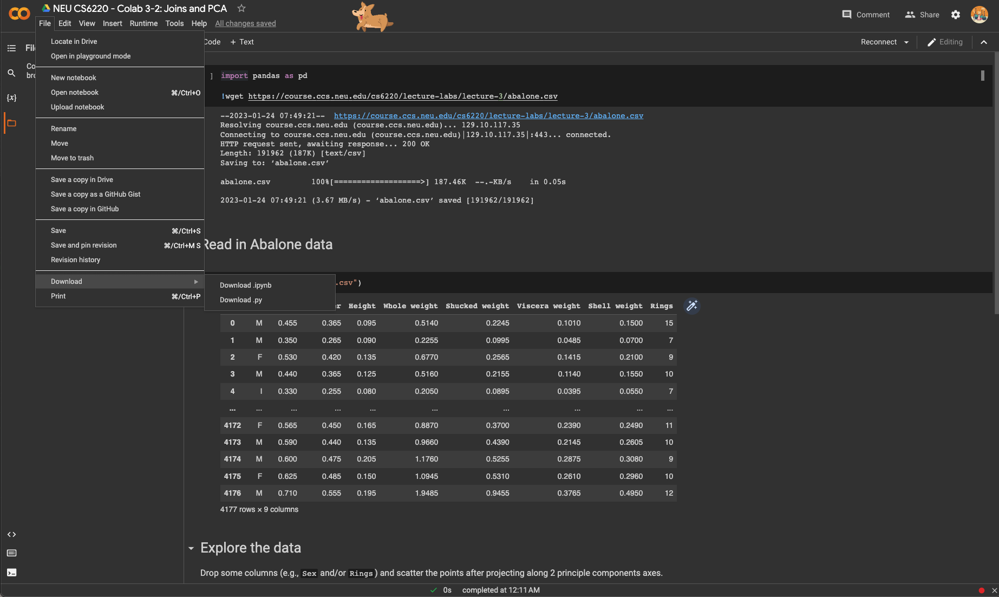

# Laboratories for Week 3

You should have reached this template from [Github Classrooms](https://classroom.github.com/a/v14_XUDg). 

Download your *.ipynb files from Colab. It should look like:

Then submit by providing your repository link to [Gradescope](https://www.gradescope.com/courses/494275/) under Week 3, All Colabs.

